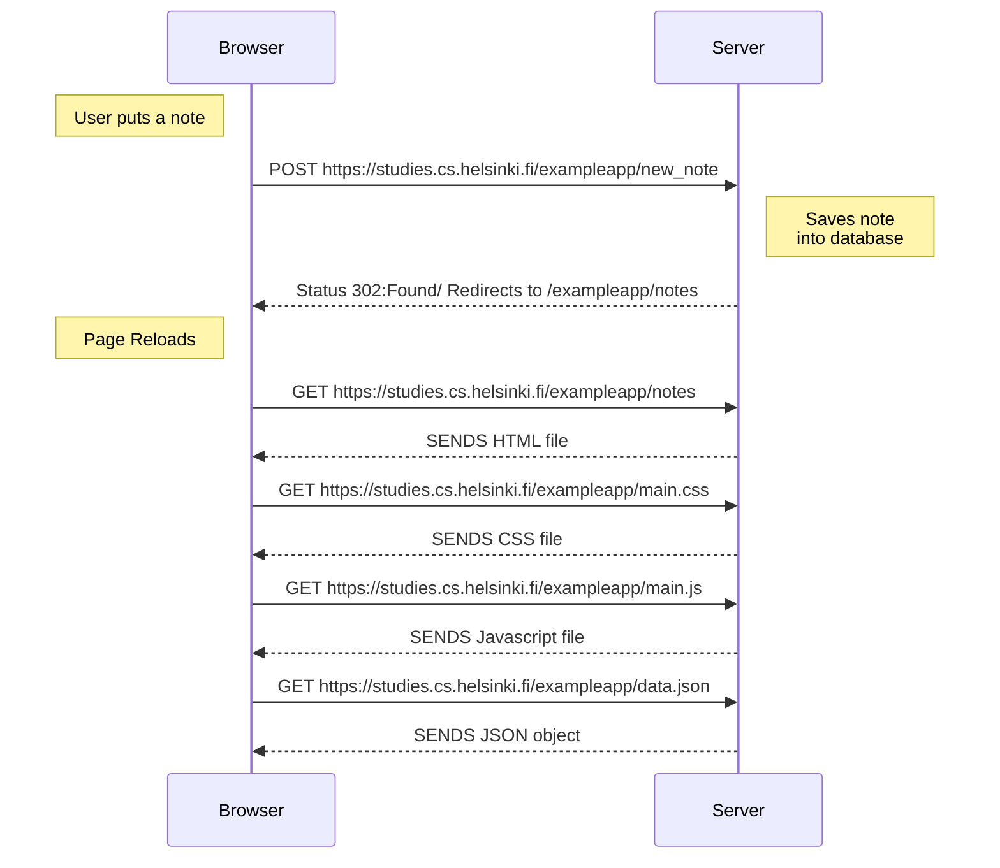

```mermaid
sequenceDiagram

Note left of Browser: User puts a note
Browser->>Server: POST https://studies.cs.helsinki.fi/exampleapp/new_note

Note right of Server: Saves note<br/>into database
Server -->> Browser: Status 302:Found/ Redirects to /exampleapp/notes

Note left of Browser: Page Reloads

Browser->>Server: GET https://studies.cs.helsinki.fi/exampleapp/notes

Server -->> Browser: SENDS HTML file

Browser->>Server: GET https://studies.cs.helsinki.fi/exampleapp/main.css

Server -->> Browser: SENDS CSS file

Browser->>Server: GET https://studies.cs.helsinki.fi/exampleapp/main.js

Server -->> Browser: SENDS Javascript file

Browser->>Server: GET https://studies.cs.helsinki.fi/exampleapp/data.json

Server -->> Browser: SENDS JSON object
```
