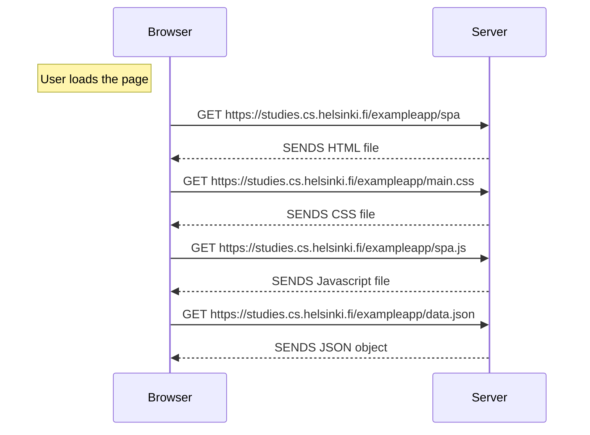

```mermaid
sequenceDiagram

Note left of Browser: User loads the page
Browser->>Server: GET https://studies.cs.helsinki.fi/exampleapp/spa

Server -->> Browser: SENDS HTML file

Browser->>Server: GET https://studies.cs.helsinki.fi/exampleapp/main.css

Server -->> Browser: SENDS CSS file

Browser->>Server: GET https://studies.cs.helsinki.fi/exampleapp/spa.js

Server -->> Browser: SENDS Javascript file

Browser->>Server: GET https://studies.cs.helsinki.fi/exampleapp/data.json

Server -->> Browser: SENDS JSON object

```
