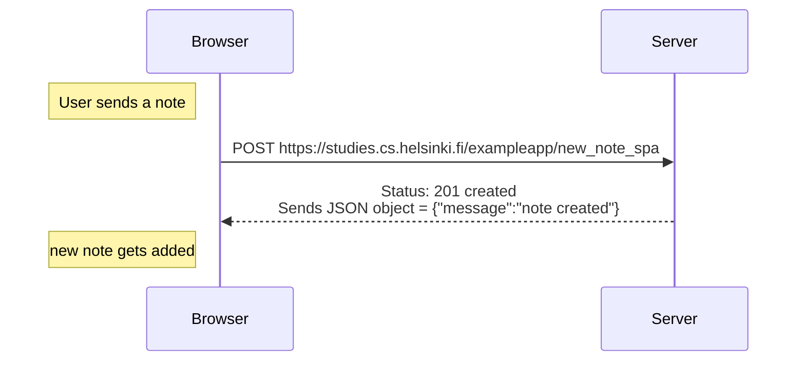

```mermaid
sequenceDiagram

Note left of Browser: User sends a note
Browser->>Server: POST https://studies.cs.helsinki.fi/exampleapp/new_note_spa

Server -->> Browser: Status: 201 created<br/>Sends JSON object = {"message":"note created"}


Note left of Browser: new note gets added

```
